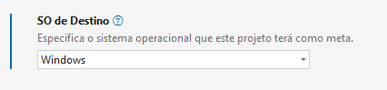

# NetWindowsFirewall

NetWindowsFirewall é uma micro biblioetca com métodos auxiliares para gerenciar o Firewall do Windows.

A biblioteca COM `NetFwTypeLib` é usada para gerenciar o Firewall do Windows pelo **NetWindowsFirewall**.

[**Veja NetWindowsFirewall Legacy para .NET Framework 4.8**](https://github.com/kempdec/NetWindowsFirewall-Legacy)

## Instalação

1. Instale a biblioteca a partir do NuGet.

``` powershell
Install-Package KempDec.NetWindowsFirewall
```

2. Altere o **"SO de Destino"** do seu projeto para `Windows`.

Para alterar pelo **Visual Studio**, clique com o botão direito no seu projeto e vá em **Propriedades (Alt + Enter)**.
  


Para alterar por código, abra o arquivo com extensão `.csproj` do seu projeto e adicione `-windows` após a versão do
framework, dentro da tag `<TargetFramework/>`. Exemplo:
  ``` xml
  <!-- Antes. -->
  <TargetFramework>net8.0</TargetFramework>
  <!-- Depois. -->
  <TargetFramework>net8.0-windows</TargetFramework>
  ```

## Como usar

Você pode usar a instância estática, obtida através de `NetWindowsFirewall.Instance`, como no exemplo abaixo:

``` csharp
var ipAddress = IPAddress.Parse("127.0.0.1");

// Adiciona uma regra de bloqueio (de entrada) para o endereço de IP "127.0.1" no Firewall do Windows.
NetWindowsFirewall.Instance.AddBlockInIpRule($"IP {ipAddress} bloqueado", ipAddress);

// Adiciona uma regra de bloqueio (de saída) para o endereço de IP "127.0.0.1" no Firewall do Windows.
NetWindowsFirewall.Instance.AddBlockOutIpRule($"IP {ipAddress} bloqueado", ipAddress);
```

Ou você pode usar a partir de uma nova instância criada manualmente:

``` csharp
var ipAddress = IPAddress.Parse("127.0.0.1");
var netWindowsFirewall = new NetWindowsFirewall();

// Adiciona uma regra de bloqueio (de entrada) para o endereço de IP "127.0.1" no Firewall do Windows.
netWindowsFirewall.AddBlockInIpRule($"IP {ipAddress} bloqueado", ipAddress);

// Adiciona uma regra de bloqueio (de saída) para o endereço de IP "127.0.0.1" no Firewall do Windows.
netWindowsFirewall.AddBlockOutIpRule($"IP {ipAddress} bloqueado", ipAddress);
```

## Métodos disponíveis

Os métodos disponíveis são:

``` csharp
// Adiciona uma nova regra de permissão (de entrada) para um endereço de IP no Firewall do Windows.
public void AddAllowInIpRule(string name, IPAddress ipAddress);

// Adiciona uma nova regra de permissão (de entrada e saída) para um endereço de IP no Firewall do Windows.
public void AddAllowIpRule(string name, IPAddress ipAddress);

// Adiciona uma nova regra de permissão para um endereço de IP no Firewall do Windows.
public void AddAllowIpRule(string name, IPAddress ipAddress, NET_FW_RULE_DIRECTION_ direction);

// Adiciona uma nova regra de permissão (de saída) para um endereço de IP no Firewall do Windows.
public void AddAllowOutIpRule(string name, IPAddress ipAddress);

// Adiciona uma nova regra de bloqueio (de entrada) para um endereço de IP no Firewall do Windows.
public void AddBlockInIpRule(string name, IPAddress ipAddress);

// Adiciona uma nova regra de bloqueio (de entrada e saída) para um endereço de IP no Firewall do Windows.
public void AddBlockIpRule(string name, IPAddress ipAddress);

// Adiciona uma nova regra de bloqueio para um endereço de IP no Firewall do Windows.
public void AddBlockIpRule(string name, IPAddress ipAddress, NET_FW_RULE_DIRECTION_ direction);

// Adiciona uma nova regra de bloqueio (de saída) para um endereço de IP no Firewall do Windows.
public void AddBlockOutIpRule(string name, IPAddress ipAddress);

// Adiciona a regra especificada para o Firewall do Windows.
public void AddRule(INetFwRule rule);

// Obtém uma nova regra do Firewall do Windows.
public static INetFwRule GetNewRule();

// Obtém as regras do Firewall do Windows.
public static INetFwRules GetRules();

// Adiciona o endereço de IP especificado para a regra especificada.
public static void AddIpToRule(string ruleName, IPAddress ipAddress);

// Remove o endereço de IP especificado para a regra especificada.
public static void RemoveIpToRule(string ruleName, IPAddress ipAddress);
```

## Colaboração

Ajude-nos a deixar a biblioteca de código aberto cada vez melhor, criando um **pull request**.

## Autores

- [**KempDec**](https://github.com/kempdec) - Mantedora do projeto de código aberto.
- [**Vinícius Lima**](https://github.com/viniciusxdl) - Desenvolvedor .NET C#.

## Licença

[MIT](https://github.com/kempdec/NetWindowsFirewall/blob/main/LICENSE)
